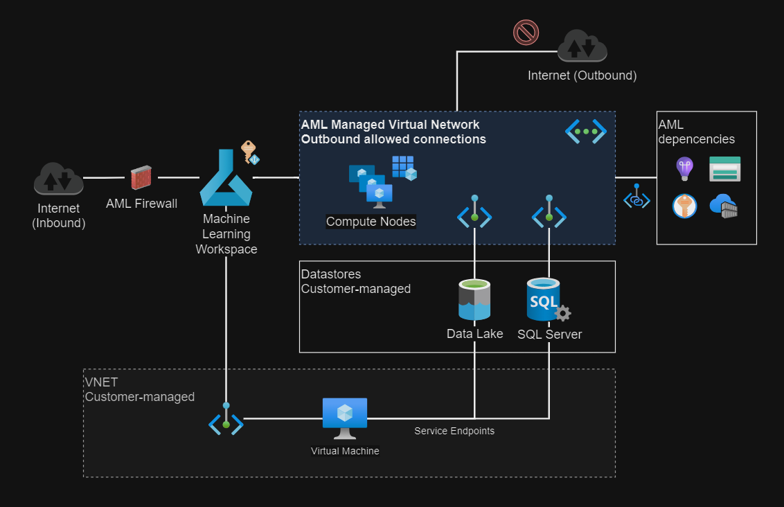
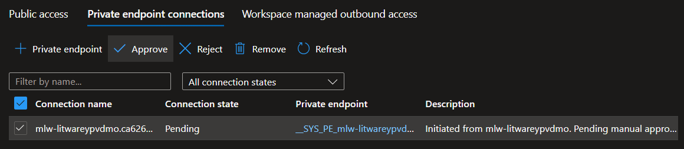
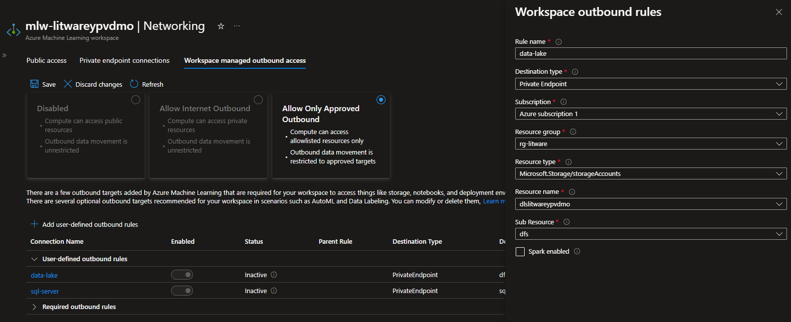
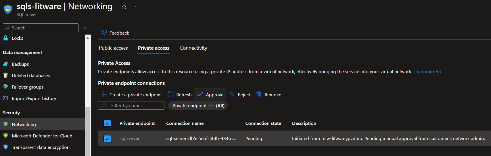

# Azure ML

Azure Machine Learning workspace with private datastores connected with private endpoints.



## 1 - Setup

Copy the template `.auto.tfvars` configuration file:

```sh
cp config/template.tfvars .auto.tfvars
```

Set the `allowed_ip_address` to allow connectivity to Azure.

Optionally, generate an SSH key pair to be used for compute node connection:

```sh
mkdir keys
ssh-keygen -f keys/ssh_key
```

## 2 - Apply

Create the resources:

```sh
terraform init
terraform apply -auto-approve
```

To complete the process, a private endpoint must be approved when the compute is created:

> 💡 The execution will halt until the manual approval is done.



The first run will take more time as the managed VNET is created.

> ℹ️ The managed VNET is created with the compute. Private endpoints should active after or available for approval.

The workspace will be created with `AllowOnlyApprovedOutbound`. Configure the outbound access in the [managed VNET][1] using a preferred interface (add the data lake and the SQL database), which will enable secure outbound access via private endpoints.

> 💡 A Container Registry with `Premium` SKU is required.

## 3 - Outbound rules

Once all resources are created, the data stores must be registered in the outbound rules section in order to use them securely via private connections.



It might be required to perform manual private endpoint approvals, such as in this example for the SQL Server:



## 4 - Datastores

It's time to connect the data sources to the AML workspace. These connections should happen via private endpoints.

**Create a secret** for the pre-create Application Registration in Entra ID that can be used to setup connections to the data lake. Optionally, it can also be used for the SQL Server, but it will require an external authentication setup which is not covered here - SQL authentication should be enough for this demo.

---

### Clean-up

Delete the resources and avoid unplanned costs:

```sh
terraform destroy -auto-approve
```

[1]: https://learn.microsoft.com/en-us/azure/machine-learning/how-to-managed-network?view=azureml-api-2&tabs=azure-cli
