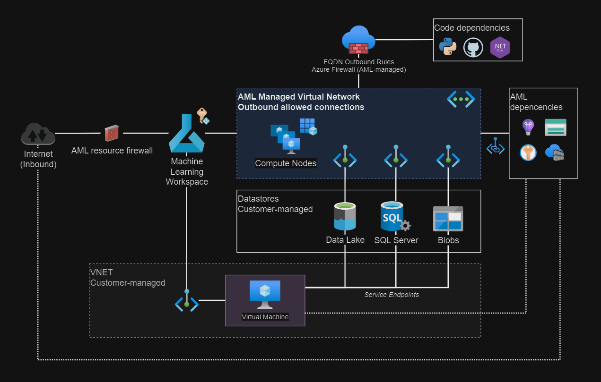

# Azure ML with Private Endpoints

Azure Machine Learning workspace security features, deployed to a managed VNET, with private datastores via private endpoints, as well as an optional workspace private endpoint.



## 1 - Setup

Copy the template `.auto.tfvars` configuration file:

> [!IMPORTANT]
> A public workspace has some [limitations](#issues-and-limitations) when connecting to private resources, which need extra configuration when using private datastores.

```sh
cp config/template.tfvars .auto.tfvars
```

Set the `allowed_ip_address` to allow connectivity to Azure.

(Optional) If using a public compute, generate an SSH key pair to be used for connection:

```sh
mkdir keys
ssh-keygen -f keys/ssh_key
```

## 2 - Apply

### Step 1 - Create the project

Apply the resources:

```sh
terraform init
terraform apply -auto-approve
```

Once all resources are created run the step 2.

For a managed VNET setup, there are three isolation modes:

| Isolation Mode | Terraform value |
|-----|-----|
| Disabled | `Disabled` |
| Allow Internet Outbound | `AllowInternetOutbound` |            
| Allow Only Approved Outbound | `AllowOnlyApprovedOutbound` |

> [!IMPORTANT]
> Using `AllowOnlyApprovedOutbound` will create an Azure Firewall with Standard SKU, which adds significant costs.

The workspace will be created with `AllowInternetOutbound`. Configure the outbound access in the [managed VNET][1] using a preferred interface (add the data lake and the SQL database), which will enable secure outbound access via private endpoints.

> [!IMPORTANT]
> A Container Registry with `Premium` SKU is required for private endpoints.

### Step 2 - Create the AML Compute Instance

> [!NOTE]
> Due to limitations with the Terraform provider, compute commands will proceed using the Azure CLI.

> [!TIP]
> By default, the managed VNET is created along with the compute. Private endpoints should be active after or available for approval.

```sh
az ml workspace provision-network -g rg-litware -n <my_workspace_name>
```

Create the compute instance. This is using [CLI V2 notation][12]:

> [!WARNING]
> Current YAML notation does not allow configuring public access, with the exception of SSH. Make sure to use `--enable-node-public-ip false` for increased security as the default is `true`.

```sh
az ml compute create \
    --file compute.yml \
    --resource-group my-resource-group \
    --workspace-name my-workspace \
    --enable-node-public-ip false
```

To complete the process via Terraform, a private endpoint must be manually approved when the compute is created. I assume this endpoint is required to enable the instances to communicate with the workspace.

> [!IMPORTANT]
> The execution will halt until the manual approval is done, so keep watching for when the approval is requested.


## 3 - Outbound rules

Once all resources are created, the data stores must be registered in the outbound rules section in order to use them securely via private connections.

To use the CLI, install the [ML extension][7]:

```sh
az extension add -n ml
```

And then create the rules:

```sh
az ml workspace outbound-rule set -g rg-litware \
    --rule datalake \
    --type private_endpoint \
    --workspace-name mlw-litware<abc123> \
    --service-resource-id <ID> \
    --spark-enabled true \
    --subresource-target dfs
```

Or, it might be easier via the Portal integration:


It might be required to perform manual private endpoint approvals, such as in this example for the SQL Server:


## 4 - Datastores

It's time to connect the data sources to the AML workspace. These connections should happen via private endpoints. Datastore connection is documented, such as in [this page][3] or [this article][4].

👉 **Create a secret** for the pre-create Application Registration in Entra ID that can be used to setup connections to the data lake. Optionally, it can also be used for the SQL Server, but it will require an external authentication setup which is not covered here - SQL authentication should be enough for this demo.

👉 **Register the datastore** in order to securely and productively connect to data resources.

Once the datastores are registered, they become usable via notebooks. In the next example a file is downloaded from a Blob storage.

```python
import os
import azureml.core
from azureml.core import Workspace, Datastore, Dataset

ws = Workspace.from_config()

datastore = Datastore.get(ws, datastore_name='blobs')
datastore.download(target_path="./output", prefix="contacts.csv", overwrite=False)

arr = os.listdir('./output')
print(arr)

file = open("./output/contacts.csv", "r").read()
print(file)
```

Alternatively, prefer using SDK v2 for [workspace][10] and [data][11] operations.

## 5 - Private AML workspace setup

The most secure architecture for AML would be a private AML workspace, meaning that the workspace would be accessible only via a private endpoint, and the dependent resources and data stores also accessible via private connections.

To enable private access for this project, change these variables as follows:

```terraform
mlw_public_network_access_enabled = false
mlw_create_private_endpoint_flag  = true
vm_create_flag                    = true
```

Then `apply` the configuration. Once applied, access tot he AML workspace should be possible only using the VM.

Service endpoints should be already created for the datastores, so next step would be to disable public access to storages and databases and make the architecture 100% private.

AML components resources should also be set to private if possible. For example, the workspace storage needs to be visible to the users in the private network, but not from the internet in this use case.

## Firewall costs

As per Microsoft [documentation][8], a Firewall with `Standard` SKU will be created and the respective cost increase will apply.

> FQDN outbound rules are implemented using Azure Firewall. If you use outbound FQDN rules, charges for Azure Firewall are added to your billing. The Azure Firewall (standard SKU) is provisioned by Azure Machine Learning.

To avoid this, one option is using a customer-managed VNET which is also the [recommended option][9].

## Issues and limitations

There are some [limitations][2] when using a public access which will need some special configuration. I've opened [this thread][5] in which I'm asking Msft to add further details on which combinations are actually validar or invalid, and what additional configuration is required.

I've also ran into [this issue][6] where creating a `Dataset` is not working.

It is important to notice that users of the Azure ML Studio must have line of sight of the workspace storage. Here is an example with the console traces demonstrating that:


---

### Clean-up

Delete the resources and avoid unplanned costs:

```sh
terraform destroy -auto-approve
```

[1]: https://learn.microsoft.com/en-us/azure/machine-learning/how-to-managed-network?view=azureml-api-2&tabs=azure-cli
[2]: https://learn.microsoft.com/en-us/azure/machine-learning/how-to-configure-private-link?view=azureml-api-2&tabs=cli#enable-public-access
[3]: https://learn.microsoft.com/en-us/AZURE/machine-learning/how-to-access-data?view=azureml-api-1
[4]: https://k21academy.com/microsoft-azure/dp-100/datastores-and-datasets-in-azure/
[5]: https://github.com/MicrosoftDocs/azure-docs/issues/120843
[6]: https://stackoverflow.com/q/78176515/3231778
[7]: https://learn.microsoft.com/en-us/azure/machine-learning/how-to-configure-cli?view=azureml-api-2&tabs=public
[8]: https://learn.microsoft.com/en-us/azure/machine-learning/how-to-managed-network?view=azureml-api-2&tabs=azure-cli#pricing
[9]: https://learn.microsoft.com/en-us/azure/machine-learning/how-to-network-isolation-planning?view=azureml-api-2#recommended-architecture-use-your-azure-vnet
[10]: https://learn.microsoft.com/en-us/azure/machine-learning/migrate-to-v2-resource-workspace?view=azureml-api-2
[11]: https://learn.microsoft.com/en-us/azure/machine-learning/migrate-to-v2-assets-data?view=azureml-api-2
[12]: https://learn.microsoft.com/en-us/azure/machine-learning/reference-yaml-compute-instance?view=azureml-api-2
